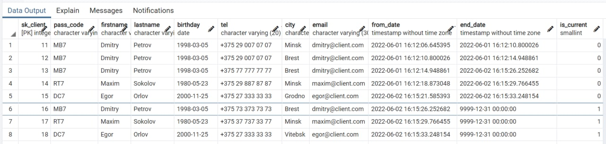

## Selection

### DIM_CAR
```
SELECT * FROM DIM_CAR;
```
- #### Day 1:
    

- #### Day 2:
    

- #### Day 3:
    


### DIM_MANAGER
```
SELECT * FROM DIM_MANAGER;
```
- #### Day 1:
    

- #### Day 2:
    

- #### Day 3:
    


### DIM_CLIENT
```
SELECT * FROM DIM_CLIENT;
```
- #### Day 1:
    

- #### Day 2:
    

- #### Day 3:
    


### DIM_STORAGE
```
SELECT * FROM DIM_STORAGE;
```
- #### Day 1:
    

- #### Day 2:
    

- #### Day 3:
    


### DIM_SHOW_ROOM
```
SELECT * FROM DIM_SHOW_ROOM;
```
- #### Day 1:
    

- #### Day 2:
    

- #### Day 3:
    


### DIM_DATE
```
SELECT * FROM DIM_DATE;
```
- #### Day 1:
    

- #### Day 2:
    

- #### Day 3:
    


### FACT_SALES
```
SELECT * FROM FACT_SALES;
```


```
SELECT BRAND, MODEL, DIM_MANAGER.FIRSTNAME AS MGR_FIRSTNAME, 
	DIM_MANAGER.LASTNAME AS MGR_LASTNAME, 
	DIM_CLIENT.FIRSTNAME AS CLIENT_FIRSTNAME, DIM_CLIENT.LASTNAME AS CLIENT_LASTNAME,
	MONTH, SHOW_ROOM_NAME, PRICE
FROM FACT_SALES 
JOIN DIM_CAR
ON FACT_SALES.SK_CAR = DIM_CAR.SK_CAR
JOIN DIM_MANAGER
ON FACT_SALES.SK_MANAGER = DIM_MANAGER.SK_MANAGER
JOIN DIM_CLIENT
ON FACT_SALES.SK_CLIENT = DIM_CLIENT.SK_CLIENT
JOIN DIM_DATE
ON FACT_SALES.SK_SALES_DATE = DIM_DATE.SK_SALES_DATE
JOIN DIM_SHOW_ROOM
ON FACT_SALES.SK_SHOW_ROOM = DIM_SHOW_ROOM.SK_SHOW_ROOM;
```


### FACT_SALES_PIPELINE
```
SELECT * FROM FACT_SALES_PIPELINE;
```


```
SELECT BRAND, MODEL, DIM_CLIENT.FIRSTNAME AS CLIENT_FIRSTNAME, DIM_CLIENT.LASTNAME AS CLIENT_LASTNAME,
	DIM_STORAGE.STREET, MF_ORDER_DATE.FULL_DATE, ST_DELIVERY_DATE.FULL_DATE, 
	CLIENT_ORDER_DATE.FULL_DATE, CLIENT_DELIVERY_DATE.FULL_DATE, MF_PRICE, DAYS_BTW_CLNT_ORDER_DLVRY
FROM FACT_SALES_PIPELINE 
JOIN DIM_CAR
ON FACT_SALES_PIPELINE.SK_CAR = DIM_CAR.SK_CAR
JOIN DIM_CLIENT
ON FACT_SALES_PIPELINE.SK_CLIENT = DIM_CLIENT.SK_CLIENT
JOIN DIM_STORAGE
ON FACT_SALES_PIPELINE.SK_STORAGE = DIM_STORAGE.SK_STORAGE
JOIN MF_ORDER_DATE
ON FACT_SALES_PIPELINE.SK_MF_ORDER_DATE = MF_ORDER_DATE.SK_MF_ORDER_DATE
JOIN ST_DELIVERY_DATE
ON FACT_SALES_PIPELINE.SK_ST_DELIVERY_DATE = ST_DELIVERY_DATE.SK_ST_DELIVERY_DATE
JOIN CLIENT_ORDER_DATE
ON FACT_SALES_PIPELINE.SK_CLIENT_ORDER_DATE = CLIENT_ORDER_DATE.SK_CLIENT_ORDER_DATE
JOIN CLIENT_DELIVERY_DATE
ON FACT_SALES_PIPELINE.SK_CLIENT_DELIVERY_DATE = CLIENT_DELIVERY_DATE.SK_CLIENT_DELIVERY_DATE;
```


### FACT_STORAGE_SNAPSHOT
```
SELECT * FROM FACT_STORAGE_SNAPSHOT;
```


```
SELECT BRAND, MODEL, DIM_STORAGE.STREET, SNAPSHOT_DATE.FULL_DATE, DAYS_ON_STORAGE
FROM FACT_STORAGE_SNAPSHOT 
JOIN DIM_CAR
ON FACT_STORAGE_SNAPSHOT.SK_CAR = DIM_CAR.SK_CAR
JOIN DIM_STORAGE
ON FACT_STORAGE_SNAPSHOT.SK_STORAGE = DIM_STORAGE.SK_STORAGE
JOIN SNAPSHOT_DATE
ON FACT_STORAGE_SNAPSHOT.SK_SNAPSHOT_DATE = SNAPSHOT_DATE.SK_SNAPSHOT_DATE;
```

