# Flask service
- [About service](#About)
- [How to run](#How_to_run)
___
## <a name="About"></a> About this service
- #### /index -Start page with links to other endpoint services
    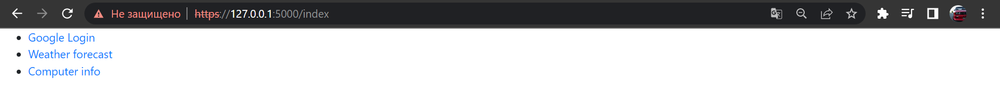
    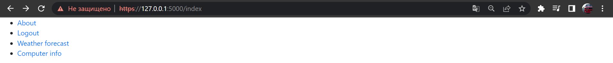
- #### /login - OAuth в Google
    
- #### /get_weather - city input
    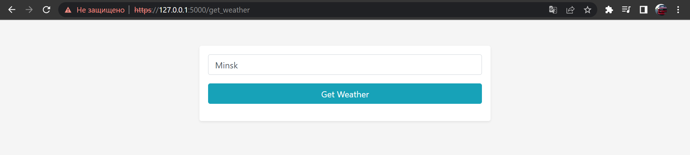
- #### /list/city - Weather in city for the next 7 days
    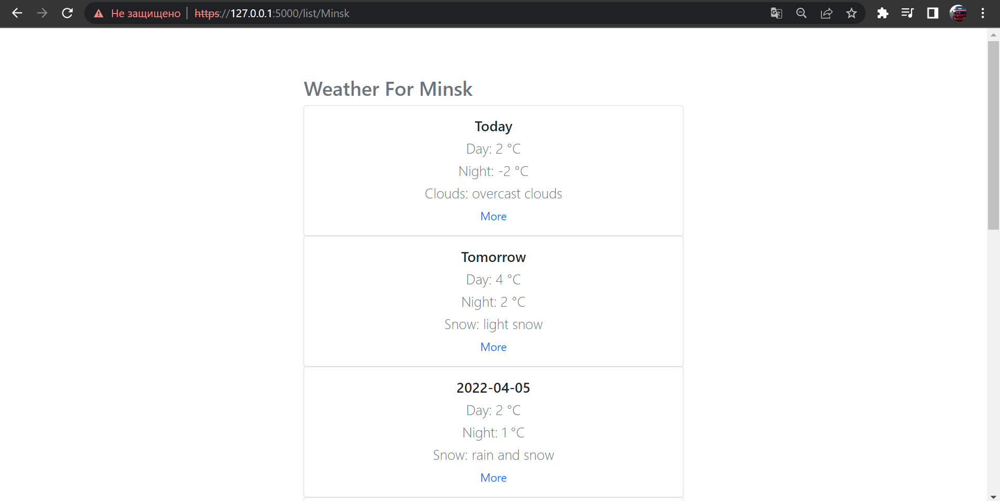
    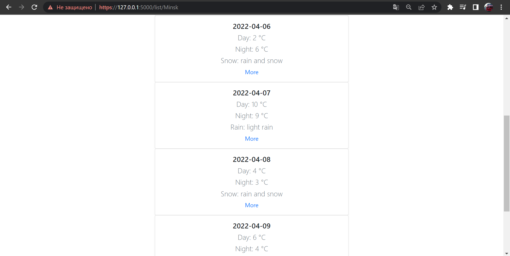
    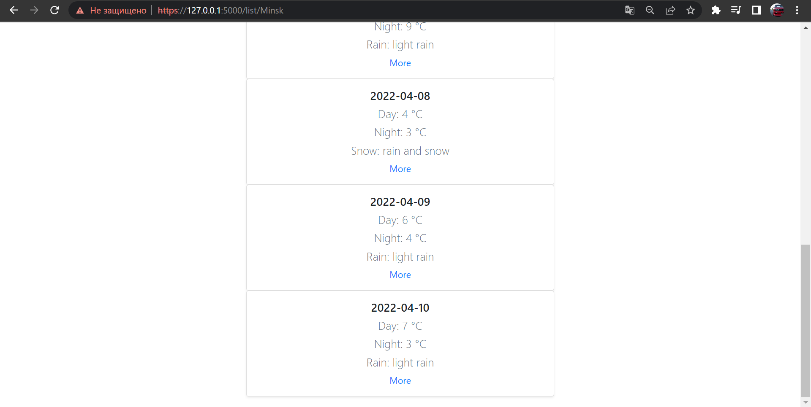
- #### /city/date - Weather in city for a specific date
    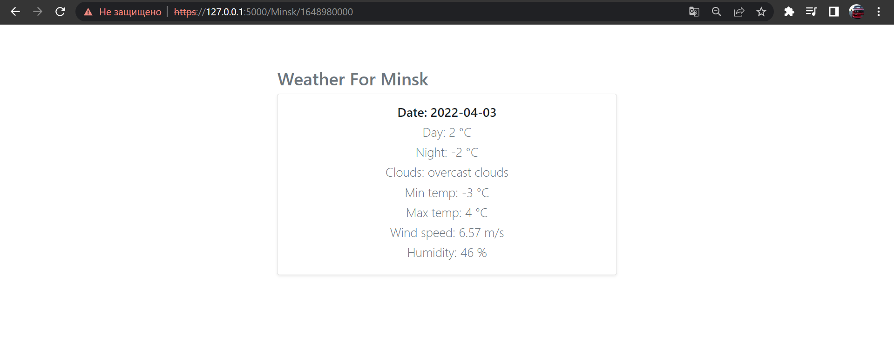
- #### /about - Information about you based on information from login
    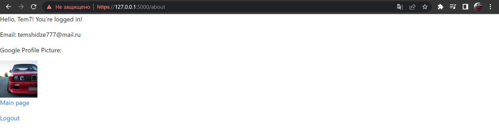
- #### /useragent - Getting information about what OS you are using and what browser you have
    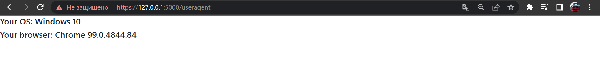
- #### /logout
  - logout and redirect to /index
      
- ---
## <a name="How_to_run"></a> How to run
- 3 ways:
  - [Create docker image locally](#Create_docker_image_locally)
  - [Download from Docker Hub](#Download_from_Docker_Hub)
  - [Run using k8s](#Run_using_k8s)
___
### <a name="Create_docker_image_locally"></a> Create docker image locally
Clone this project using the command:
```
git clone https://github.com/kvtim/training.git
```
Go to the project directory:
```
cd ./python/Flask_service
```
Build docker image:
```
docker build -t flask_service .
```
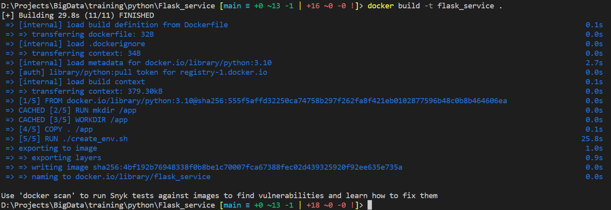
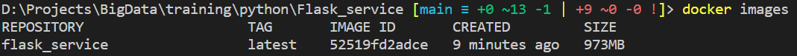
Run container based on this image:
```
docker run -it -d -p 5000:5000 --env-file ./config/.env_list --name service --rm flask_service  
```
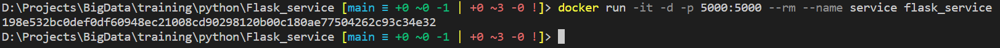

You can find this service on [https://localhost:5000](https://localhost:5000/) or [https://127.0.0.1:5000](https://127.0.0.1:5000/)

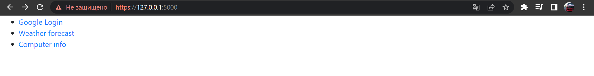

To stop container run this command:
```
docker stop service
```
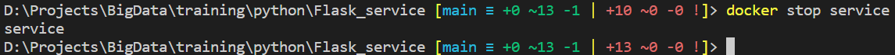

---
### <a name="Download_from_Docker_Hub"></a>  Download from Docker Hub
Run this command in your terminal:
```
docker run -it -d -p 5000:5000 --env-file ./config/.env_list --name service --rm kvtim/flask_service  
```
Docker will download the image and run the container
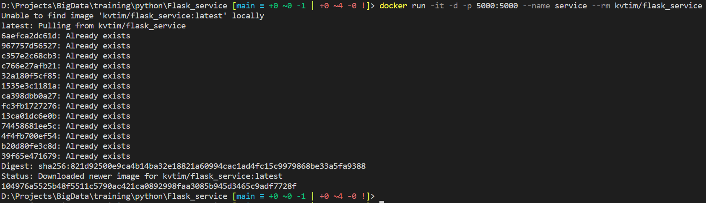

You can find this service on [https://localhost:5000](https://localhost:5000/) or [https://127.0.0.1:5000](https://127.0.0.1:5000/)

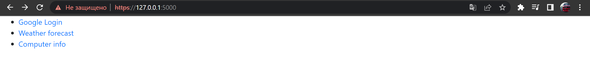

To stop container run this command:
```
docker stop service
```
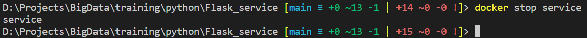

---
### <a name="Run_using_k8s"></a> Run using k8s
Clone this project using the command:
```
git clone https://github.com/kvtim/training.git
```
Go to the k8s directory:
```
cd ./python/Flask_service/k8s
```
Start minikube:
```
minikube start
```
Create secret:
```
kubectl apply -f ./secret.yaml 
```
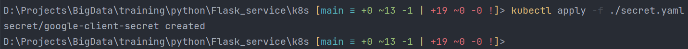
Create deployment:
```
kubectl apply -f deployment.yaml  
```
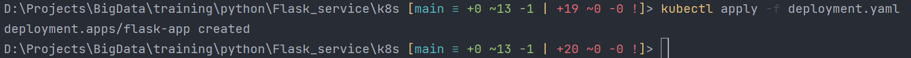
Create service:
```
kubectl apply -f service.yaml
```
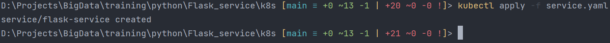
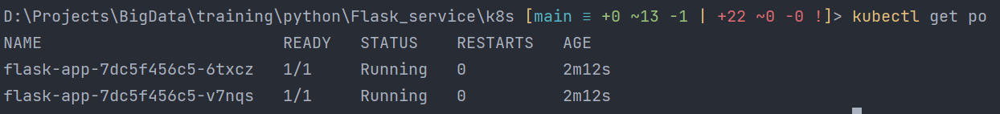
Forward port:
```
kubectl port-forward {pod NAME} 5000:5000
```
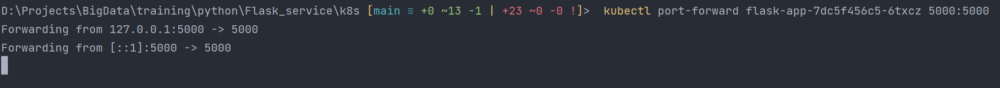

You can find this service on [https://localhost:5000](https://localhost:5000/) or [https://127.0.0.1:5000](https://127.0.0.1:5000/)

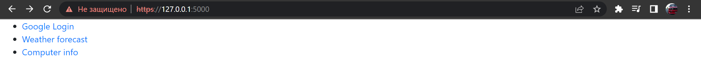
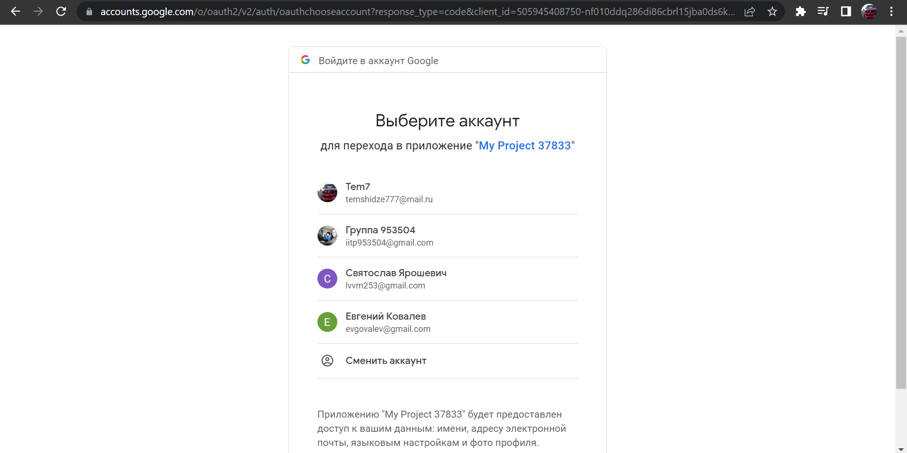
Press ^C to exit:
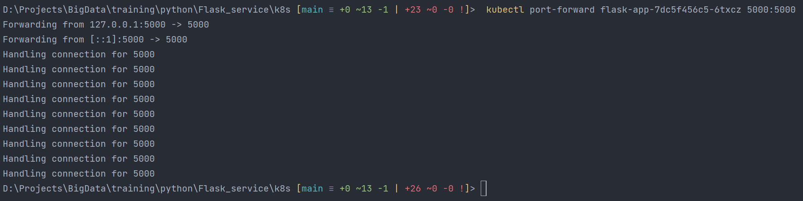
Stop minikube:
```
minikube stop
```
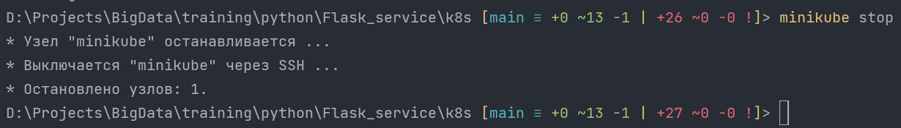
